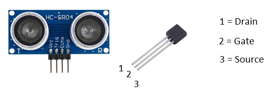

# SmartWasteManagment

SmartWasteManagment is a device which tracks a regular garbage bin indoor aswell as outdoor. The device is triggered when opening the lid and will send valuable data such as inside temperature, capacity and location to either LoRa or Dash7 gateways. This data will be able to be processed by a backend python script to further implement the visualization in ThingsBoard. 

### Information

Project name: SmartWasteManagment 

Course: I-IoT Low Power Embedded Communication 

Professor + Assistents: Maarten Weyn, Michiel Aernouts, Mats De Meyer 

Contributors: Gregory Gonzalez Lopez, Mouhcine Oulad Ali, Wesley Van Wijnsberghe

### Hardware & Software needed

Vagrant 

Riot OS : https://github.com/RIOT-OS/RIOT

Dash7 Python Support: https://github.com/MOSAIC-LoPoW/pyd7a

Murata Modem Support: https://github.com/MOSAIC-LoPoW/riot-oss7-modem

Nucleo L496ZG 

Octa connect shield 

Octa connect Murata modem shield 

Octa connnect GPS shield 

Python 2.7

MongoDB Compass 

The Things Network Account 

ThingsBoard Account

### Visualization of project + Course of action

--- add picture ---

### Implementation

1. Copy contents to the correct location in the RIOT directory: 

  - Vagrantfile --> RIOT/
  
  - boards/octa --> RIOT/boards 
  
  - drivers/include --> RIOT/drivers/include 
  
  - drivers/ --> RIOT/drivers  // if you don't want to overwrite makefiles see later on for workaround 
  
  - src/SmartWasteManagment --> RIOT/tests // other directories are tests for the drivers 
  
  - sys/auto_init/saul --> RIOT/sys/auto_init/saul
  
  - sys/auto_init --> RIOT/sys/auto_init
  
  - Copy the following scripts from PythonCode to a directory of your choosing: backend, localization, SmartWasteManagment & thingsboard

2. Import the contents of full_dataset.json in a MongoDB database called FingerprintingDB with a collection no_test_ack .

3. Open Command Prompt and navigate to the RIOT directory. 

4. Start vagrant in this directory (command: vagrant up) and connect to it (command: vagrant ssh).

5. Connect the ultrasonic sensor to the nucleo (see further).

6. Navigate to RIOT/test/SmartWasteManagment and program it on the octa board (command: make BOARD=octa flash) 

7. Open Python program of your choosing (we used PyCharm) and make sure you're using Python 2.7 

8. Install the Pymongo and numpy plugins. 

9. Run the backend.py script and make sure both localization.py, SmartWasteManagment.py and thingsboard.py are in the same directory

10. The script should now connect to both an D7 and LoRa broker assuming you are in range. 

11. The actions are monitorable in a serial monitor (Putty) when connected to the Octa board.


### Copy code to Makefile.dep & Makefile.include in case of not wanting to overwrite

- Makefile.dep: 
```
ifneq (,$(filter GPS,$(USEMODULE)))
  FEATURES_REQUIRED += periph_i2c
endif 

ifneq (,$(filter lsm303agr,$(USEMODULE)))
   FEATURES_REQUIRED += periph_i2c
endif 

ifneq (,$(filter srf04,$(USEMODULE)))
  USEMODULE += xtimer
  FEATURES_REQUIRED += periph_gpio
  FEATURES_REQUIRED += periph_gpio_irq
endif 

ifneq (,$(filter sht31,$(USEMODULE)))
  USEMODULE += xtimer
  FEATURES_REQUIRED += periph_i2c
endif
```

- Makefile.include: 
``` 
ifneq (,$(filter sht31,$(USEMODULE)))
  USEMODULE_INCLUDES += $(RIOTBASE)/drivers/sht31/include
endif 

ifneq (,$(filter GPS,$(USEMODULE)))
  USEMODULE_INCLUDES += $(RIOTBASE)/drivers/GPS/include
endif 

ifneq (,$(filter lsm303agr,$(USEMODULE)))
  USEMODULE_INCLUDES += $(RIOTBASE)/drivers/lsm303agr/include
endif 

ifneq (,$(filter srf04,$(USEMODULE)))
  USEMODULE_INCLUDES += $(RIOTBASE)/drivers/srf04/include
endif
```

### Connecting ultrasonic sensor to nucleo board



- Connections: all connected pins on Nucleo are on bottom side
  - Mosfet: 
    - Drain --> ground pin on Nucleo 
    - Gate --> pin PB14 on Nucleo 
    - Source --> ground pin on ultrasonic sensor 
  - Ultrasonic sensor: 
    - VCC --> 5v pin on Nucleo 
    - echo --> pin PB15 on Nucleo 
    - Trig --> pin PB1 on Nucleo 
    - GND --> Source mosfet

